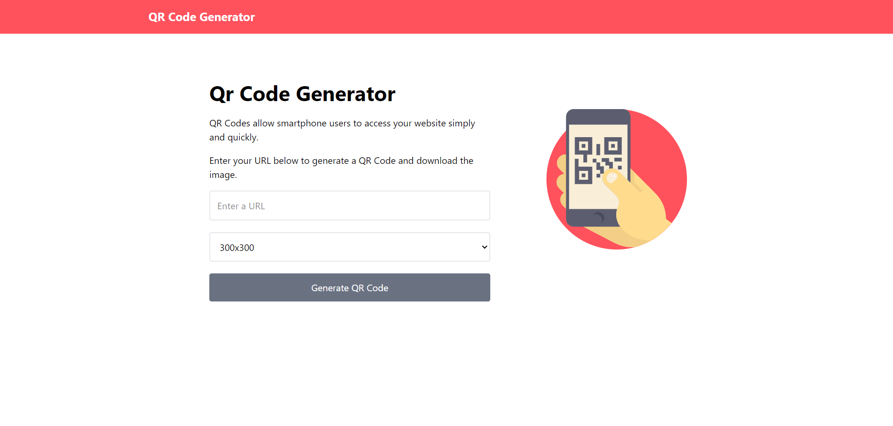

# 🔳 QR Code Generator
> A clean and responsive web application that generates downloadable QR codes for any URL in seconds.
> 
[](https://www.loom.com/share/6ad1142f0bcc4f089c0d5894d7305210)

---

## ✨ Features

- Generate QR codes from any valid URL  
- Multiple size options (100x100 up to 700x700)  
- Loading spinner for better UX  
- Modern UI using Google Fonts (Poppins)  
- Downloadable QR code image

--- 

## 🛠️ Tech Stack

- **HTML5** – Semantic and accessible structure  
- **Tailwind CSS** – Utility-first styling for rapid UI development  
- **JavaScript (Vanilla)** – DOM manipulation & logic  
- **QRCode.js** – QR code generation library
 
---

## 👀 Why This Project Stands Out

- Instant QR code generation with customizable sizes  
- Clean, modern UI built with Tailwind CSS  
- Fully responsive design (mobile-first)  
- Download-ready QR codes  
- Demonstrates ability to learn, follow tutorials, and implement features independently  

---

## 🧠 What I Learned

- How to integrate **third-party JavaScript libraries**
- Building **responsive layouts** using Tailwind CSS
- Managing **user input validation**
- Improving UX with **loading indicators**
- Translating tutorial knowledge into a working project

> 📌 *This project was built by following a YouTube tutorial, which helped me understand best practices and reinforced my ability to learn new tools quickly and apply them effectively.*

---

## ⚙️ How to Run Locally

1. Clone the repository  
   ```bash
   git clone https://github.com/FrontEndHighRoller/QR-Generator.git
2. Open index.html in your browser
3. Resize the screen to see responsive layouts and image switching in action 🎯

---

🙋‍♂️ Author
Dennis Rumanek

GitHub: https://github.com/FrontEndHighRoller

LinkedIn: https://www.linkedin.com/in/dennis-rumanek/

⭐ If you like this solution, feel free to star the repository!


